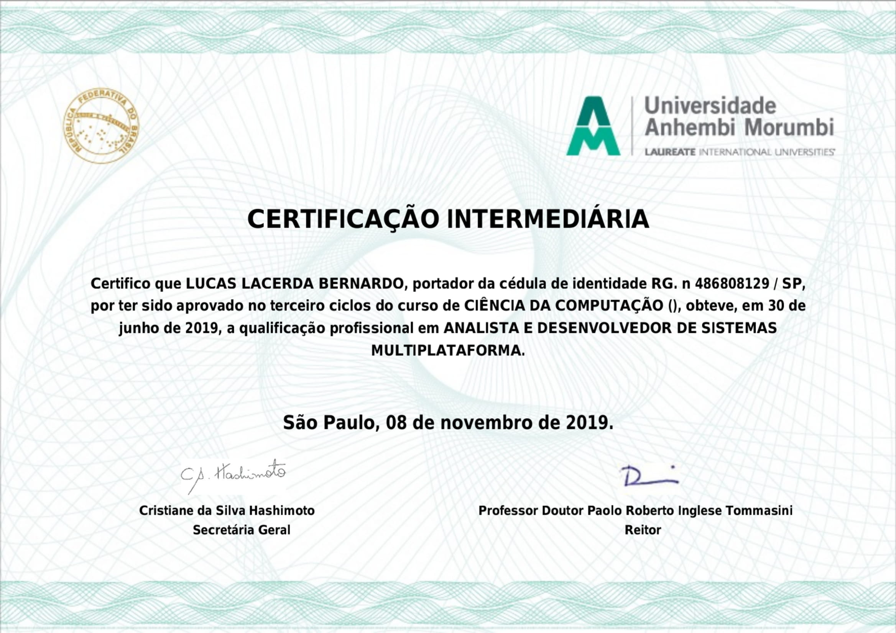

```
.
├── DATA SCIENCE: PRIMEIROS PASSOS.pdf
├── DEEP LEARNING PARTE 1: INTRODUÇÃO COM KERAS.pdf
├── Docker: Criando containers sem dor de cabeça.pdf
├── java
│   ├── ANDROID I: CRIE SUA APP FANTASTICA COM ANDROID STUDIO.pdf
│   ├── JAVA E JPA: OTIMIZACOES COM JPA2 E HIBERNATE.pdf
│   ├── JAVA E JPA: PERSISTA SEUS OBJETOS COM A JPA2 E HIBERNATE.pdf
│   ├── MAVEN: BUILD DO ZERO A WEB.pdf
│   ├── SERVLETS: FUNDAMENTOS DE JAVA NA WEB.pdf
│   ├── SPRING BOOT PARTE 1: CONSTRUA UMA API REST.pdf
│   └── SPRING BOOT PARTE 2: SEGURANÇA DA API, CACHE E MONITORAMENTO.pdf
├── MONGODB: UMA ALTERNATIVA AOS BANCOS RELACIONAIS TRADICIONAIS.pdf
├── python
│   ├── Flask parte 1: Crie uma webapp com Python 3.pdf
│   └── Python Pandas: Tratando e analisando dados.pdf
├── README.md
├── UAM-ANALISTA-DE-SISTEMAS.jpg
└── UAM-ANALISTA-DE-SISTEMAS.pdf

```

